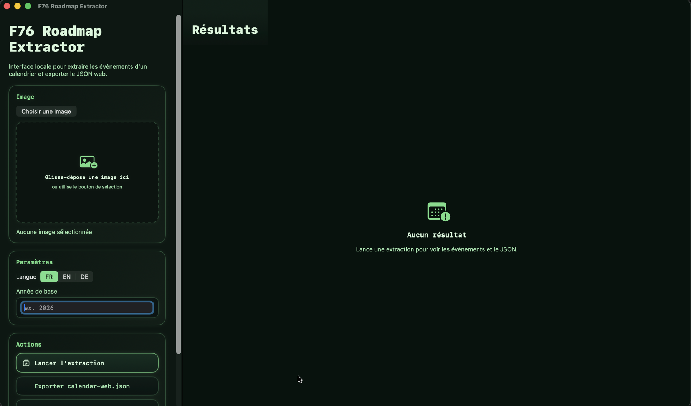
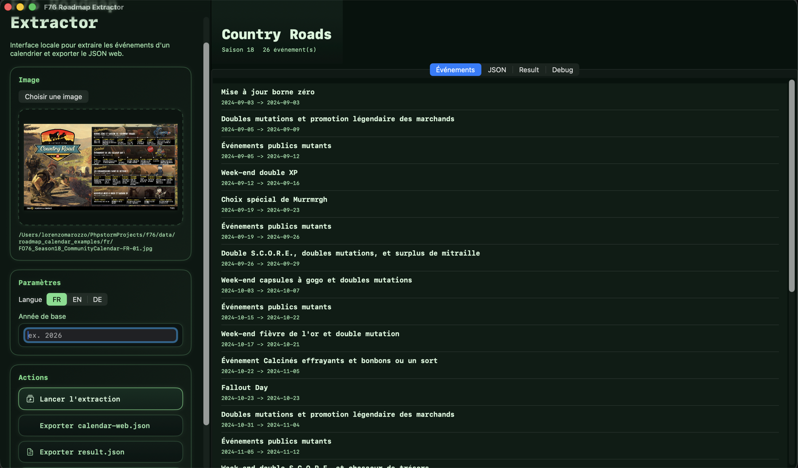
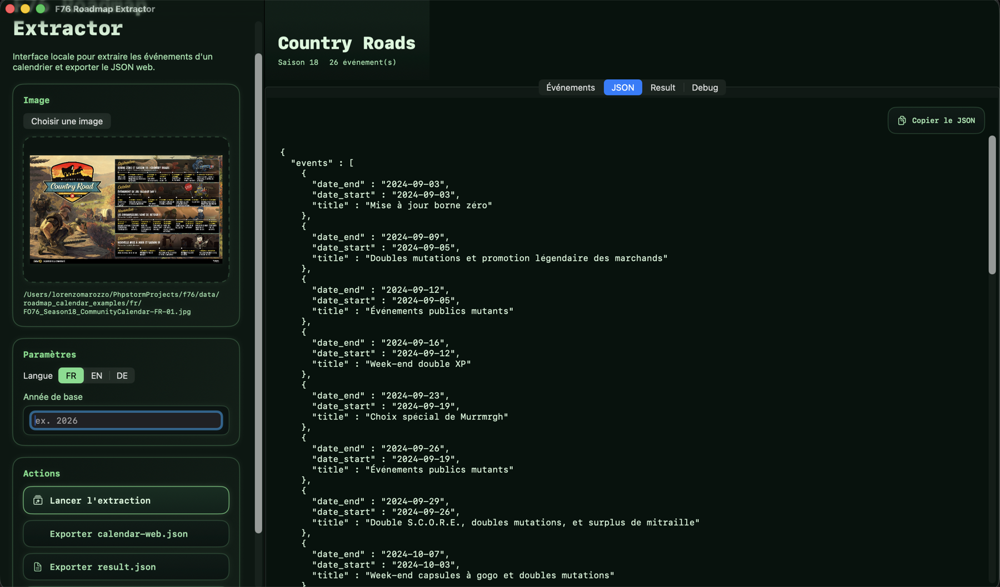

# F76 Roadmap Extractor

[Version française](README.md)

Local macOS tool that extracts Fallout 76 season events from an official roadmap image and exports them as JSON.

The main goal of this project is to turn an official community roadmap image into structured data that can be reused by [f76-tools](https://github.com/Grandpere/f76-tools), including features that display and work with the seasonal event calendar in a web UI.

The project runs fully locally:

- no subscription
- no external API
- no paid OCR dependency
- powered by Apple's native `Vision` OCR framework

## Screenshot





## Features

- OCR extraction from official Fallout 76 roadmap images
- event and date parsing specialized for seasonal roadmaps
- stable JSON export for web integration
- current locale support for `FR`, `EN`, and `DE`
- macOS graphical app for non-terminal usage
- debug output for hard OCR cases
- packaging as a real `.app` and `.dmg`

## Use Case

Intended workflow:

1. download the official roadmap for a new season
2. run extraction on the FR, EN, or DE image
3. generate `calendar-web.json`
4. reuse that JSON in [f76-tools](https://github.com/Grandpere/f76-tools)

The project was hardened using older season images so it can better handle:

- noisy titles
- truncated dates
- busy artwork-heavy visuals
- imperfect OCR

Examples of compatible source images are available in:

- [f76-tools / data / roadmap_calendar_examples](https://github.com/Grandpere/f76-tools/tree/main/data/roadmap_calendar_examples)

## Requirements

- macOS 13 or newer
- Apple developer tools installed

Quick check:

```bash
xcode-select -p
```

If needed:

```bash
xcode-select --install
```

## Installation

Clone the repository:

```bash
git clone <repo-url>
cd ocr
```

Build the macOS app:

```bash
xcrun swift build --scratch-path .build-scratch --product F76RoadmapExtractor
```

Build the smoke tests:

```bash
xcrun swift build --scratch-path .build-scratch --product ocr-smoketests
```

## CLI Usage

Basic extraction:

```bash
xcrun swift run --scratch-path .build-scratch ocr \
  --image /path/to/roadmap.jpg \
  --locale fr-FR \
  --base-year 2026
```

Direct export for the web tool:

```bash
xcrun swift run --scratch-path .build-scratch ocr \
  --image /path/to/roadmap.jpg \
  --locale fr-FR \
  --web-json ./calendar-web.json
```

Full debug export:

```bash
xcrun swift run --scratch-path .build-scratch ocr \
  --image /path/to/roadmap.jpg \
  --locale fr-FR \
  --base-year 2026 \
  --debug-dir ./debug-calendar
```

The debug folder contains:

- `calendar-web.json`: normalized output for integration
- `result.json`: detailed internal extraction result
- `debug.json`: OCR traces and merged lines
- `raw-lines.txt`: merged OCR text

## Target JSON Format

Primary output consumed by the web tool:

```json
{
  "season": 24,
  "name": "Wildwood",
  "events": [
    {
      "date_start": "2026-03-03",
      "date_end": "2026-03-03",
      "title": "Wildwood update"
    }
  ]
}
```

Current rules:

- ISO 8601 dates
- events sorted by `date_start`
- `date_end` is always required
- titles remain in the language of the image
- `season` and `name` are inferred from the image when possible

## macOS App

Launch the app:

```bash
xcrun swift run --scratch-path .build-scratch F76RoadmapExtractor
```

The interface supports:

- choosing or drag-and-dropping an image
- selecting `FR`, `EN`, or `DE`
- entering or pre-filling the base year
- previewing extracted events
- previewing the web JSON
- copying JSON to the clipboard
- exporting `calendar-web.json`, `result.json`, or a debug bundle
- reopening recently used images

## Build a Real macOS App

Create the `.app` bundle:

```bash
./scripts/build-app.sh
```

Output:

```bash
./dist/F76 Roadmap Extractor.app
```

By default, the app is locally signed using ad-hoc signing.

To use a real `codesign` identity:

```bash
SIGN_IDENTITY="Developer ID Application: Your Name (TEAMID)" ./scripts/build-app.sh
```

## Build a DMG

Create the `.dmg`:

```bash
./scripts/build-dmg.sh
```

Output:

```bash
./dist/F76 Roadmap Extractor.dmg
```

The script first attempts a styled DMG. If macOS blocks the cosmetic Finder customization step, it automatically falls back to a simple but valid DMG.

## Verification

Run the smoke tests:

```bash
xcrun swift run --scratch-path .build-scratch ocr-smoketests
```

## Current Status

- `FR`: strong reliability
- `EN`: strong reliability
- `DE`: good reliability on the real German images available in the archive

The engine is optimized for a specific visual family: official Fallout 76 roadmaps. It is not intended to be a general-purpose OCR engine for arbitrary calendars.

## Known Limitations

- some very noisy images can still produce partially OCR-shaped titles
- year inference may need `--base-year` when copyright OCR is unreliable
- some historical images labeled `DE` are not actually in German
- Apple notarization is not part of this project

## Technical Stack

- `Swift`
- `Vision`
- `SwiftUI`
- macOS shell scripts for packaging

## Related Project

The JSON exported by this tool is meant to be consumed by:

- [f76-tools](https://github.com/Grandpere/f76-tools)
